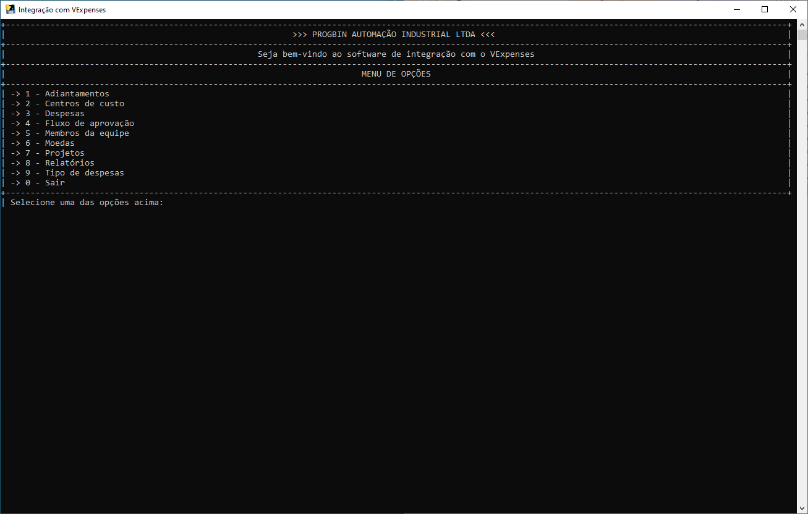
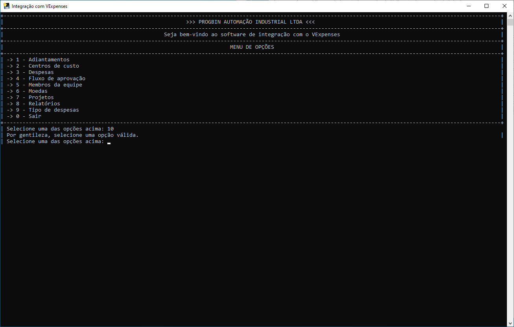
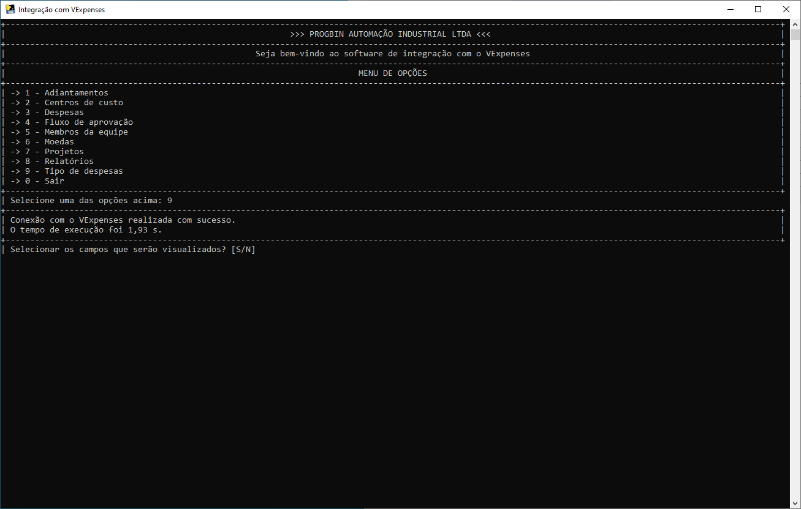
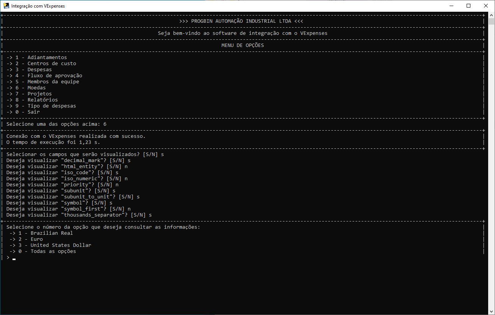
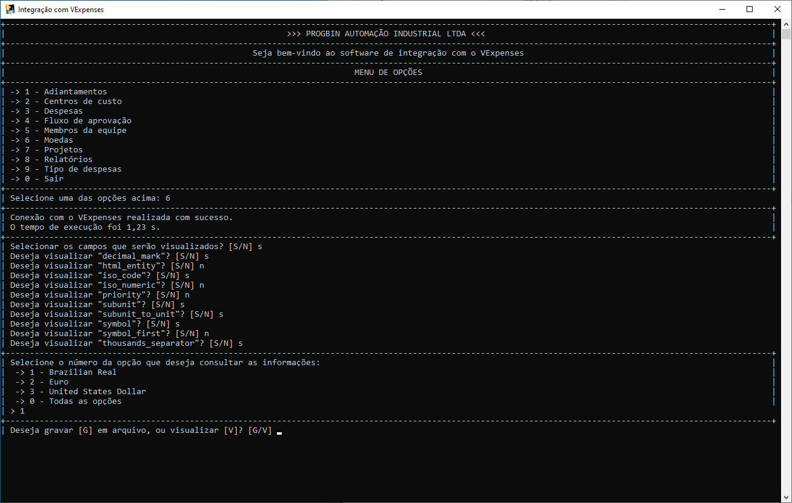
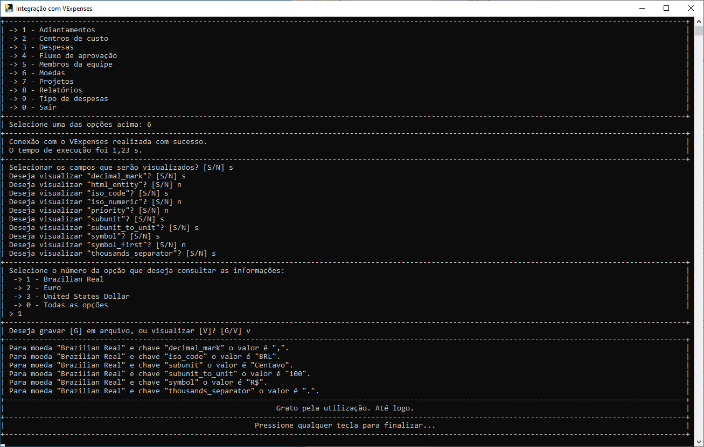

[![Contributors][contributors-shield]][contributors-url]
[![Forks][forks-shield]][forks-url]
[![Stargazers][stars-shield]][stars-url]
[![Issues][issues-shield]][issues-url]
[![MIT License][license-shield]][license-url]

[contributors-shield]: https://img.shields.io/github/contributors/J-o-n-a-s/consumindo-api-vexpenses.svg?style=for-the-badge
[contributors-url]: https://github.com/J-o-n-a-s/consumindo-api-vexpenses/graphs/contributors
[forks-shield]: https://img.shields.io/github/forks/J-o-n-a-s/consumindo-api-vexpenses.svg?style=for-the-badge
[forks-url]: https://github.com/J-o-n-a-s/consumindo-api-vexpenses/network/members
[stars-shield]: https://img.shields.io/github/stars/J-o-n-a-s/consumindo-api-vexpenses.svg?style=for-the-badge
[stars-url]: https://github.com/J-o-n-a-s/consumindo-api-vexpenses/stargazers
[issues-shield]: https://img.shields.io/github/issues/J-o-n-a-s/consumindo-api-vexpenses.svg?style=for-the-badge
[issues-url]: https://github.com/J-o-n-a-s/consumindo-api-vexpenses/issues
[license-shield]: https://img.shields.io/github/license/J-o-n-a-s/consumindo-api-vexpenses.svg?style=for-the-badge
[license-url]: https://github.com/J-o-n-a-s/consumindo-api-vexpenses/blob/master/LICENSE

# Consumindo API do VExpenses

**SEJA BEM-VINDO A ESTE REPOSITÓRIO!!!**

-------------

**Instruções**

 - *Fork* este repositório;
 - Clone seu repositório *forked*;
 - Adicione seus scripts;
 - *Commit & Push*;
 - Crie um *pull request*;
 - Dê uma estrela para este repositório;
 - Aguarde que o seu *pull request* solicitado vire um *merge*;
 - Comemore, seu primeiro passo para o mundo de código aberto e continue contribuindo.

## Introdução

Projeto para manipular as informações do VExpenses atráves da API disponibilizada pela empresa. Importa salientar que para ter acesso ao *```token público```* para autenticação é necessário ter uma conta VExpenses (*não estou fazendo propaganda e não recebi patrocínio para esses desenvolvimento*), cada empresa possui um *```token público```* diferente.

O intuito do projeto é realizar consultas simples sem interface gráfica para automatizar as atividades repetitivas, tediosas e evitar erros humanos durante essas coletas. Porém posteriormente posso pensar em realizar algumas melhorias no software facilitando ainda mais a sua utilização e agregando funcionalidades facilitadoras.

## Motivação

Atualmente, em nossa empresa, nós utilizamos o VExpenses para fazer toda a gestão de todos os gastos, adiantamentos e reembolsos dos funcionários/sócios. Com o intuito de facilitar a interação com o VExpenses, sem a necessidade de acessar o site para buscar e coletar as informações manualmente, decidi estudar a API e verificar as informações disponíveis e como trabalhar com elas para facilitar a nossa vida no dia-a-dia e otimizar o nosso tempo realizando a automação desta atividade.

## Descrição do projeto

O projeto foi desenvolvido em Python 3.12 realizando o código em arquivos separados como boa prática para facilitar a localização das funções. Está sendo utilizado formatadores de código para garantir a padronização da maneira de escrever os códigos.

Nesta primeira versão, toda a interação com o software é realizada sem interface gráfica. A ideia é o usuário interagir com um menu para selecionar as opções necessária para receber a informação que precisa.

### Bibliotecas e recursos utilizados

 - OS -> Biblioteca para funções do sistema operacional;
 - Time -> Para adição de tempo e registro do início, fim e duração do processo;
 - Tkinter -> Para utilização da caixa de diálogo de seleção de diretório para exportação de arquivo;
 - Datetime -> Para pegar a data atual do sistema;
 - Requests -> Para realizar o acesso a API do VExpenses;
 - Openpyxl -> Para criação/escrita de arquivo XLSX;
 - Pyinstaller -> Para criação do arquivo executável. Facilitando a utilização do programa mesmo em máquinas que não possuem o Python instalado.

### Funcionamento do programa

O programa funciona em modo de prompt informando nome da empresa e um menu com as opções que o usuário pode selecionar. Cada menu válido selecionado apresentará mensagens distintas para seleção e mensagens distintas também para a apresentação final dos dados. É possível visualizar as informações diretamente no prompt ou ainda solicitar que os dados sejam exportados para arquivo do Excel.

Abaixo é mostrada imagem da tela e menu inicial:



Quando o usuário seleciona uma opção inválida e pressiona a tecla ```enter``` será apresentada uma mensagem informando que é necessário escolher uma opção válida. Conforme mostrado na imagem abaixo com a seleção da opção 10:



Quando o usuário seleciona uma opção, digitando um dos números válidos e pressionando a teclar ```enter```, o tempo de execução da coleta das informações do VExpenses é apresentado e uma nova opção de escolha é disponibilizada para o usuário. Conforme mostrado na imagem abaixo com a seleção da opção 6:



Seguindo com a seleção de uma opção válida, o usuário deverá informar se deseja selecionar os campos ou visualizar todos disponíveis. Se o usuário digitar ```S``` serão mostrados um a um todos as campos disponíveis da opção inicialmente selecionada. Assim o usuário poderá informe quais campos ele deseja visualizar. Se o usuário digitar ```N``` todos os campos serão apresentados sem a necessidade do usuário selecionar um por um. Na imagem abaixo o usuário selecionou ```S``` e posteriormente selecionou campo a campo quais ele deseja ou não visualizar. Ao fim da seleção dos campos são apresentadas quais subopções do menu inicialmente selecionado estão disponíveis:



 O usuário deverá selecionar o número de uma das subopções e pressionar a tecla enter para seguir. Conforme mostrado na imagem abaixo.



Por fim, o usuário deverá selecionar se deseja visualizar o arquivo ou gravar em arquivo XLSX. Necessário digitar ```G``` para gravar em arquivo ou ```V``` para visualizar diretamente no prompt. Conforme mostrado na imagem abaixo:



Como informado, para cada opção principal são disponibilizados subopções diferentes. Por isso o usuário deve ler todas os questionamentos feitos pelo programa e responder as opções que deseja para obter no final as informações desejadas. Para não ficar muito longa a explicação, apenas o menu 6 e toda sua sequência foi apresentada acima. Importante salientar que no caso de selecionar que deseja gravar o arquivo no lugar de visualizar no prompt, será necessário selecionar o caminho onde o arquivo será gravado. O nome dele será a data do dia atual no formato ano, mês e dia (AAAA_MM_DD.xlsx).

### Amostra do resultado da execução do programa

A imagem abaixo apresenta o resultado final da seleção da opção 6 do menu inicial:


## Instalação e execução do projeto

 - `pip install poetry` para instalar o gerenciador de pacotes
 - `poetry install` para que o poetry instale os pacotes usados no projeto
 - `poetry shell` para que o poetry crie um ambiente virtual
 - `python src/main.py` para executar o projeto

## Licença

MIT License
 
